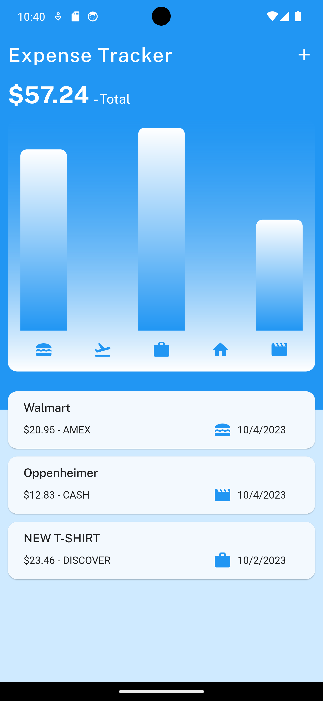
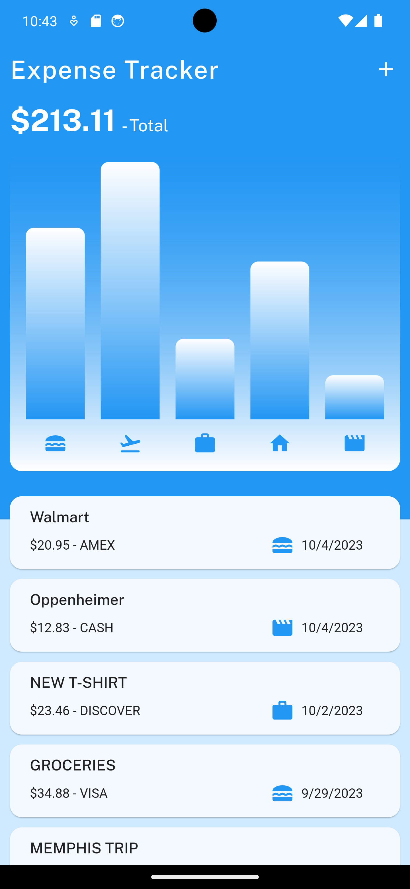
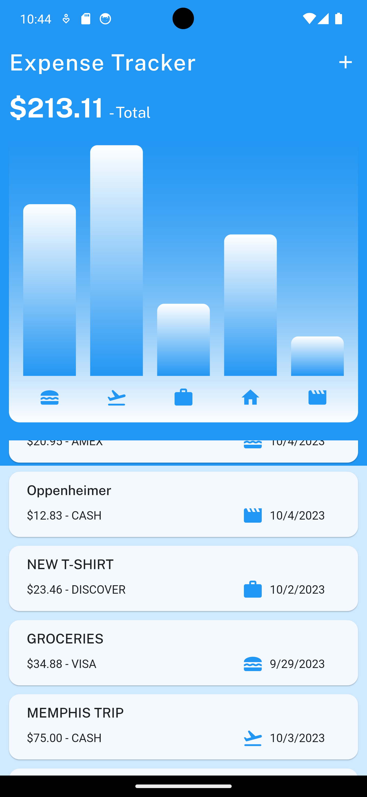
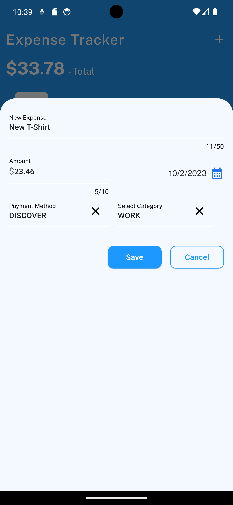
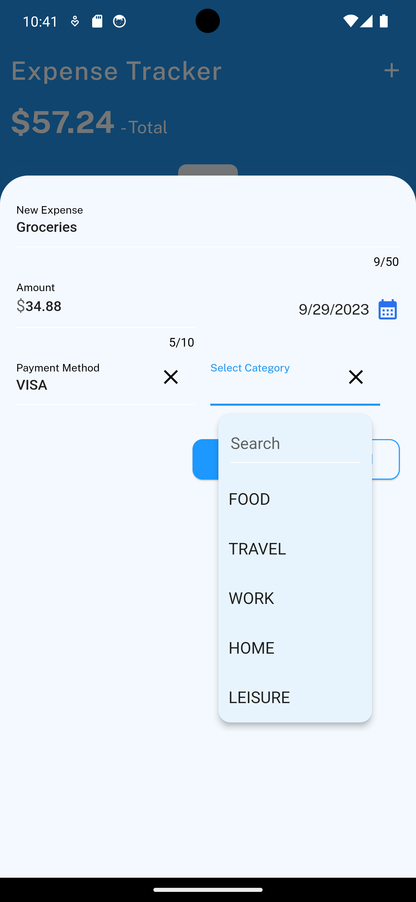
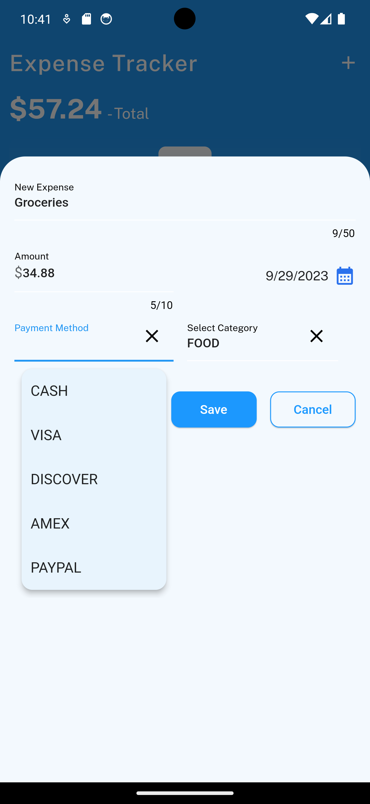
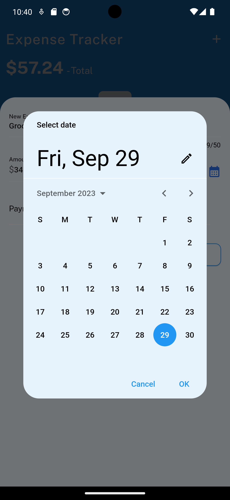

# expense-tracker
**Overview**
This Expense Tracker app, developed using the Flutter framework, provides a user-friendly and efficient solution for managing and tracking personal expenses. It offers a range of features that allow users to easily add, categorize, and monitor their expenditures, all while offering a visually appealing and intuitive user interface.

## Sample Screenshots

 
         
    
    

       

   
          
    
    
    

## Key Features:

1. **Expense Management:**
   - Users can add and remove expenses effortlessly, helping them maintain an accurate record of their financial transactions.

2. **Categorization:**
   - Expenses are intelligently categorized into various predefined categories, making it easy to analyze spending habits.

3. **Payment Methods:**
   - Users have the flexibility to assign payment methods to their expenses, providing insight into their preferred financial instruments.

4. **Date Tracking:**
   - Each expense can be associated with a specific date, allowing users to track expenditures over time and identify spending patterns.

5. **Data Visualization:**
   - A dynamic bar chart on the home screen provides a visual representation of expenses by category, offering a quick overview of where their money is going. Future updates will introduce the ability to switch between expense categories and payment methods for a more comprehensive analysis.

6. **Total Sum:**
   - The app displays the total sum of all expenses, enabling users to monitor their overall spending at a glance.

7. **User-Friendly UI:**
   - The app boasts an intuitive and responsive user interface, ensuring a seamless and enjoyable user experience.

*Future Enhancements:*

- **Category and Payment Method Management:** Adding and removing expense categories and payment methods to accommodate users' evolving financial needs.

- **Payment Method Tracking:** Expanding the app's charting capabilities to visualize expenses by payment method, offering additional insights into spending habits.

Feel free to explore the app's source code in my GitHub repository, where you can also find detailed documentation and version history. If you're interested in discussing this project further or have any inquiries, please don't hesitate to reach out.
